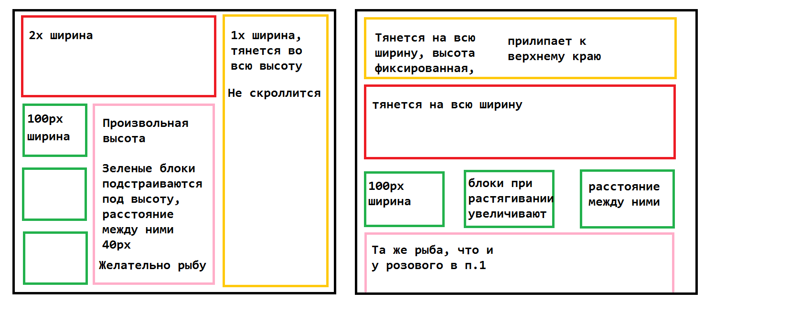

## Итерация 4. Basic JavaScript

Цель итерации:
изучить базовый синтаксис JS, модель построения приложения на JS, функциональный подход к организации кода в JS.

Задание:
добавить в HEAD подгружаемый скрипт, подкладываемый отдельным файлом рядом с HTML.
В скрипте подключить обработчики событий, которые будут выполнять следующие операции:
- арифметические операции
- работа со строками (конкатенация, экранирование, шаблонизация)
- присвоение переменных
- вывод в консоль
- логические операции
- обработка ошибок – try/catch

Также необходимо в HTML-файле добавить тег <script>, в котором будут произведены следующие операции:
- изменение контента определенного элемента
- добавление обработчиков на:
а) наведение мыши
б) клик
в) снятие курсора мыши с элемента
г) фокус инпута
д) изменение контента элемента
- функция, производящая какое-либо действие, и подключенная к любому элементу
- предотвращение работы события

Полезные ссылки для изучения:
https://learn.javascript.ru/
(этого достаточно 🙂 )

Полученные знания:
- Синтаксис JS
- Работа со строками, числами, булевыми значениями
- Логические конструкции, циклы
- Работа с DOM
- Обработчики событий
- Всплытие событий в JS
- функции JS (как отдельный пункт, помимо синтаксиса)